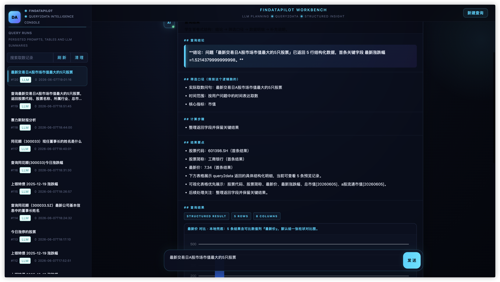

# FinDataPilot

> **Local-first, natural-language-driven financial data agent**
> 本地优先 · 自然语言驱动的金融数据智能体

<p align="center">
  <a href="README_EN.md">English</a> · <a href="README.md">简体中文</a>
</p>

<p align="center">
  
</p>

<p align="center">
  <em>From a single natural-language question to structured financial data: plan → fetch → clean → visualize → persist → summarize, in one shot.</em>
</p>

---

## ✨ What it does

| Capability | Details |
|---|---|
| 🗣️ **Natural-language queries** | Accepts Chinese / English financial questions, calls WenCai `query2data`, returns structured data |
| 🧭 **LLM-powered planning** | MiniMax LLM decomposes intent, picks fields & filters (keyword-based fallback when LLM is offline) |
| 📊 **Smart visualization** | Tables + auto-selected charts (bar / line / pie); single values / few rows / pure text → no chart |
| 💾 **Full-stack persistence** | MySQL `query_runs` / `query_columns` / `query_rows` + CSV + Parquet export |
| ⚡ **Streaming answer** | SSE protocol with typewriter effect on the front end |
| 🖥️ **Multi-entry access** | FastAPI service, CLI, React workbench, static fallback page |
| 🛡️ **Graceful degradation** | MySQL down? LLM down? React build missing? — none of them are fatal |

## 🖼️ Workbench at a glance


The screenshot above shows a complete query lifecycle (`最新交易日A股市场市值最大的5只股票` — *Top 5 A-share stocks by market cap on the latest trading day*):

1. **Execution plan** — LLM decomposes the intent, commits to "top 5 by market cap, descending"
2. **Progress bar + steps** — Each step streams in as it runs
3. **Typewriter answer** — The natural-language conclusion streams in real time
4. **Structured report** — Conclusion / Filter criteria / Calculation steps / Key findings / Data table / Caveats
5. **Smart chart** — 5 rows with comparable numerics auto-match a bar comparison chart
6. **History sidebar** — All past queries are clickable, automatically persisted in MySQL

> 💡 ECharts is lazy-loaded: it's not fetched on first paint — only after the user's first query. First-paint bundle is **~387 kB gzip**.

---

## 🏗️ Architecture

```
User query → FastAPI Router (/chat or /chat/stream)
  → Planner  (keyword rules + MiniMax LLM, with fallback)
    → QUERY2DATA() → WenCai API → pandas DataFrame
      → Analysis  (moving_average / return / volatility / max_drawdown, optional)
        → Storage (CSV + Parquet + MySQL)
          → Summarizer (MiniMax or local fallback)
            → Response (JSON or SSE stream) → React frontend
```

### Directory layout

| Directory | Role |
|---|---|
| `app/api/` | FastAPI routers: `chat.py`, `health.py`, `history.py`, `files.py` |
| `app/agent/` | Core pipeline: `planner.py`, `executor.py`, `llm_assistant.py`, `streaming.py`, `analysis.py` |
| `app/tools/` | External clients: `iwencai_client.py` → `query2data.py`, `minimax_client.py` |
| `app/storage/` | MySQL persistence: `schema.sql`, `mysql.py`, `repository.py` |
| `app/utils/` | Helpers: `env.py`, `trace.py`, `dataframe.py` |
| `web/` | React 18 + TypeScript + Vite 7 + Ant Design 5 + ECharts 5 + TanStack Query 5 |
| `scripts/` | CLI and utility scripts |
| `app/web/` | Static fallback single page (used when React build is missing) |

---

## 🚀 Quick Start

### 1. Clone

```bash
git clone https://github.com/shuaiwang888/findata-pilot.git
cd findata-pilot
```

### 2. Configure environment

```bash
cp .env.example .env
```

Edit `.env` and fill in your keys and database credentials (**never commit `.env`**):

```bash
IWENCAI_API_KEY=your_iwencai_key          # required
MINIMAX_API_KEY=your_minimax_key          # optional; falls back to local rules if unset
MINIMAX_MODEL=minimax-2.7                  # optional
MINIMAX_BASE_URL=https://api.minimaxi.com/v1

MYSQL_HOST=127.0.0.1
MYSQL_PORT=3306
MYSQL_USER=root
MYSQL_PASSWORD=your_mysql_password
MYSQL_DATABASE=data_agent
```

### 3. Start the service

```bash
bash start.sh                              # → http://127.0.0.1:8011
```

`start.sh` will: install Python/Node deps → init MySQL schema → build the front end → launch uvicorn.

### 4. Health check

```bash
curl http://127.0.0.1:8011/health
# → {"status":"ok",...}
```

### 5. Try the CLI

```bash
python3 scripts/data_agent_cli.py --query "贵州茅台最新收盘价" --limit 1
```

---

## 📡 API cheatsheet

| Endpoint | Method | Description |
|---|---|---|
| `/health` | GET | Health probe |
| `/chat` | POST | Synchronous query + summary |
| `/chat/stream` | POST | SSE streaming |
| `/history` | GET | Query history |
| `/files/{run_id}` | GET | Download CSV / Parquet |

```bash
# Sync
curl -X POST http://127.0.0.1:8011/chat \
  -H 'Content-Type: application/json' \
  -d '{"query":"贵州茅台最新收盘价","limit":"1","save":true}'

# Stream
curl -N -X POST http://127.0.0.1:8011/chat/stream \
  -H 'Content-Type: application/json' \
  -d '{"query":"st绝味近一周的涨跌幅","limit":"10","save":true}'
```

---

## 🗄️ Persistence

`start.sh` auto-initializes the schema from `app/storage/schema.sql`, which creates three tables:

- `agent_query_runs` — metadata + summary for each query
- `agent_query_columns` — column definitions
- `agent_query_rows` — returned row data

> ⚠️ When MySQL is unavailable, the API **still serves queries** — it just skips persistence and adds a warning to the response.

Manual init:

```bash
mysql -h "$MYSQL_HOST" -P "$MYSQL_PORT" -u "$MYSQL_USER" -p < app/storage/schema.sql
```

---

## 🛡️ Graceful degradation matrix

| Component missing | Behavior |
|---|---|
| MySQL unavailable | API still responds, returns `database unavailable` warning |
| MiniMax unavailable | Auto-switches to keyword-based planning + local DataFrame summary |
| `app/web_dist/` missing | FastAPI auto-serves `app/web/index.html` static fallback |
| `.env` keys missing | Loud warnings at startup, CLI still runs with mock data |

---

## ⚙️ Configuration

| Variable | Required | Default | Description |
|---|---|---|---|
| `IWENCAI_API_KEY` | ✅ | — | WenCai `query2data` API key |
| `MINIMAX_API_KEY` | ❌ | — | LLM key; local fallback if unset |
| `MINIMAX_MODEL` | ❌ | `minimax-2.7` | Model alias |
| `MINIMAX_BASE_URL` | ❌ | `https://api.minimaxi.com/v1` | MiniMax API base URL |
| `MYSQL_HOST/PORT/USER/PASSWORD` | ❌ | `127.0.0.1:3306 root` | MySQL connection |
| `MYSQL_DATABASE` | ❌ | `data_agent` | Database name |
| `DATA_AGENT_OUTPUT_DIR` | ❌ | `outputs/tables` | CSV/Parquet export dir |
| `DATA_AGENT_HOST/PORT` | ❌ | `127.0.0.1:8011` | FastAPI bind address |

---

## 🔒 Security notes

- **Never** commit `.env` to GitHub
- **Never** paste real keys or DB passwords into issues / PRs / commit messages
- Run a quick secret scan before pushing:

```bash
rg -n "sk-[A-Za-z0-9_-]+|password|api[_-]?key|secret|token|/Users/" . \
  -g '!web/node_modules/**' \
  -g '!outputs/**' \
  -g '!app/web_dist/**' \
  -g '!**/__pycache__/**'
```

## 📜 License

MIT — see `LICENSE` (to be added).
